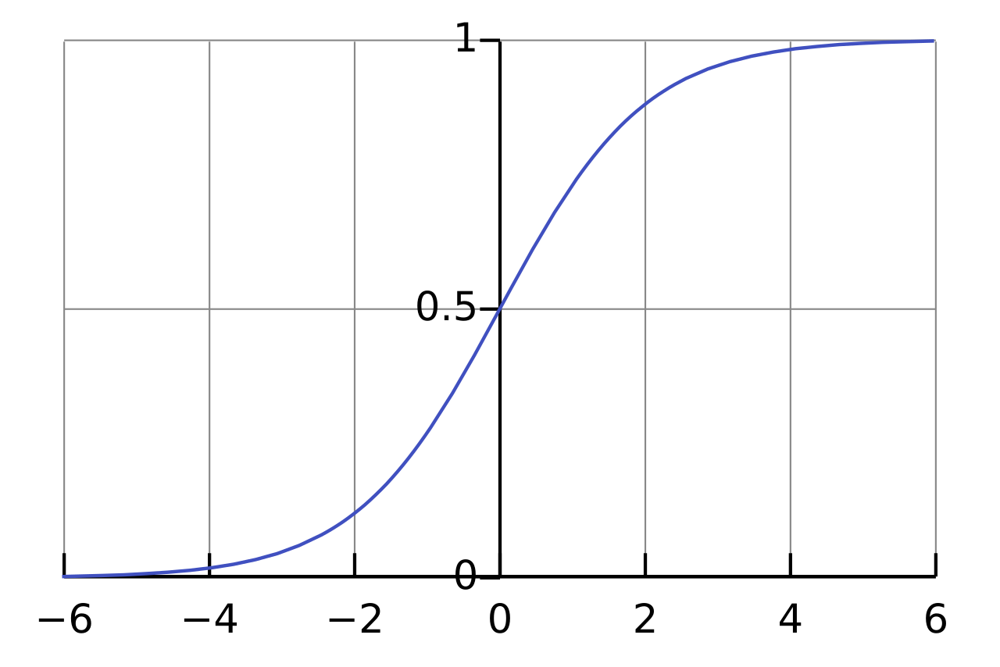
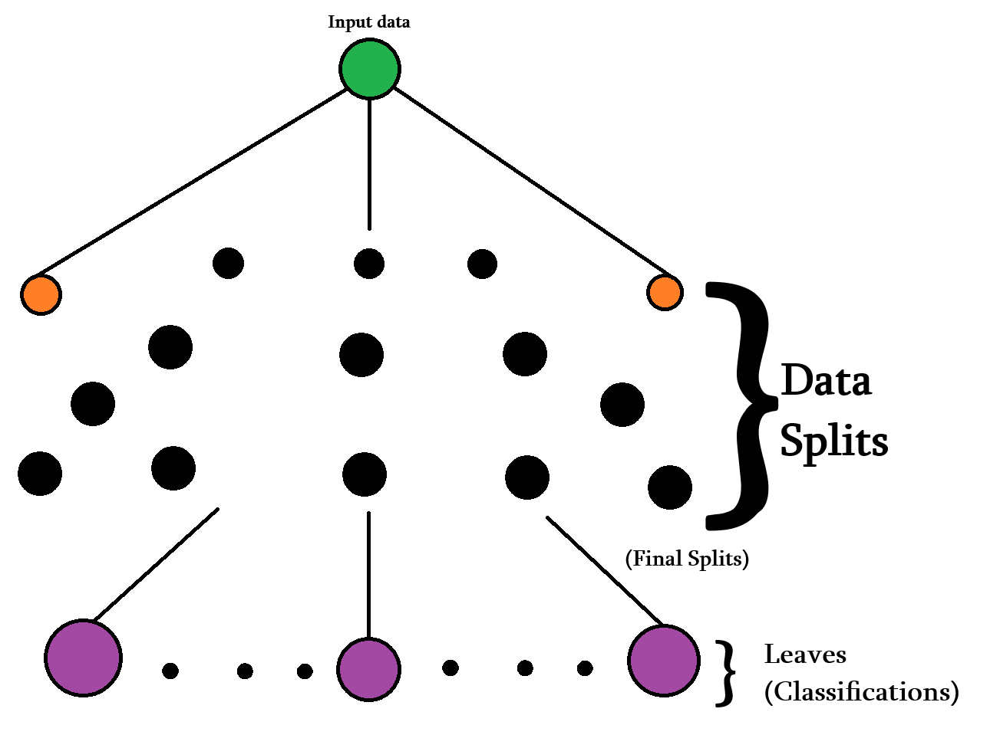

# Classification

In classification, we have a discrete number of classes that we know our inputs belong to. The goal is to properly label inputs based on their features.

## Introduction

Classification is sometimes called categorical regression (or logistic regression, if we're only categorizing between binary values), but it's not *really* regression. Regression refers to predicting continuous values. There's also no closed-form solution. To build intuition, we can think of classification tasks as regression with a transformed floor or ceiling function applied to the continuous prediction.

There are many different branches of classification. In this writeup, we'll cover some of the most important ones.

## Logistic Regression

Logistic regression is the simplest and most important form of classification to understand. It is a special case of classification that only has binary outputs. When performing logistic regression, we aim to find the best-fitting model to describe the relationship between the binary outcome and the predictor variables.

Just like linear regression, we have a set of weights $w$ which we try to optimize. With inputs $x$ and outputs $y$, we try to learn what parameters $w$ will best make future predictions $\hat{y}$. Our goal is to minimize the loss, that way we have the most accurate model possible. Of course, there are other considerations, like overfitting, but those will be covered later.

### Logistic Function (Sigmoid)

Unlike in linear regression, we don't just simply output the weighted + biased sum of the inputs. Instead, we map our intermediate result $z$, which is defined as:

$$
z = w \cdot x = w_0 + w_1 x_1 + w_2 x_2 + ... + w_n x_n
$$

and then apply the logistic (sigmoid) function to it:

$$
\sigma(z) = \frac{1}{1 + e^{-z}}
$$

which will give us an output between 0 and 1. We interpret this as the probability that the input belongs to the *positive* class (label 1). Then, we set some threshold for our predictions. For example, only if something has a 70% chance of being spam do we actually classify it as spam.

### Negative Log-Likelihood

$$
L(y, \hat{y}) = -\frac{1}{N} \sum_{i=1}^{N} \left[ y_i \log(\hat{y}_i) + (1 - y_i) \log(1 - \hat{y}_i) \right]
$$

Just like other forms of regression, we need a measure of our accuracy to know how good our model is. In logistic regression, the loss function we use is [negative log-likelihood function](https://github.com/intelligent-username/Loss-Functions?tab=readme-ov-file#7-negative-log-likelihood-nll) as our loss function. We try to minimize the average value of this function in order to improve our model. Since there is no closed-form solution, we are forced to use gradient descent in order to optimize the weights.

### Gradient Descent

We perform [gradient descent](https://github.com/intelligent-username/Gradient-Descent), just like in linear regression, to optimize our weights. The gradients of the loss function with respect to the weights are calculated as follows:

$$
\frac{\partial L}{\partial w_j} = \frac{1}{N} \sum_{i=1}^{N} (\hat{y}_i - y_i) x_{ij}
$$

We continuously update the weights using these gradients until convergence:

$$
w_{j+1} = w_j - \eta \left.\frac{\partial L}{\partial w}\right|_{w = w_j}
$$

As a reminder, our $L$ is the negative log-likelihood function, $N$ is the number of samples, $y_i$ is the true label for sample $i$, $\hat{y}_i$ is the predicted probability for sample $i$, and $x_{ij}$ is the value of feature $j$ for sample $i$.

We continue this descent until one of the convergence criteria is met.

## Decision Trees

Decision trees are to logistic regression what polynomial regression is to linear regression. They are a more complex and capture non-linear relationships between features and labels. However, instead of gradient descent, we use a greedy search algorithm.

The main idea behind decision trees is that, we start with some data, and we try to segregate it consistently based on its features until we reach a point where we can confidently distinguish between classes. This is done by selecting which feature to split on at each node in the tree. This is where our greedy search algorithm comes in. The feature that results in the highest information gain (or lowest impurity) is chosen for the split.

### Splitting Criteria

### Impurity Measures

### Greedy Algorithm

### Making Predictions

## Support Vector Machines

## Multi-Class Classification

## k-Nearest Neighbours

It would be a shame to talk about classification methods without at least mentioning k-nearest neighbours. It's not very closely related to any of the other methods we've discussed, but it's so effective that one cannot ignore it.

When using k-NN, we take a point's features and look around at the k closest points in our training data. We then take a majority vote of those k points' labels to determine the label of our input point. it is a very simple algorithm, but it often works very well. Also, k-NN gives us an early and simplistic preview into unsupervised learning.

## Project Structure

## License

This project is licensed under the MIT License. See the [LICENSE](LICENSE) file for details.
